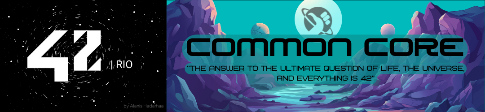

 <center>
 
 # 42cursus 💻

Projects Developed **<a href="https://42.rio/" style="color:white;">42 RIO</a>** programming school

**begin date : 16/oct/2023 🎉**

**<a href="https://profile.intra.42.fr/users/ahadama-" style="color:white;">Intra Profile</a>**



## About

```
42 is a global education initiative that offers a new way of learning technology:
no teachers, no classrooms, students learning from their fellow students (peer to peer
learning), with a methodology that develops both computing and life skills. The 42 cursus is
free for whoever is approved in its selection process* - the so-called "Piscine" - becoming
thus "cadets" (42's students).
```

</center>
For further information about 42's selection process (the "Piscine"), please visit the <a href="https://42.rio/#comoparticipar" style="color:white;font-weight:bold;">C Piscine</a>.

## PROJECT LISTS

### Common Circle

| RANK | PROJECT       | LANGUAGE              | TOPICS                                                                                               | EXPERIENCE | LAST COMMIT |
|------|---------------|-----------------------|------------------------------------------------------------------------------------------------------|------------|-------------|
| 00   | libft         | C                     | `Library` `Makefile`                                                                                 | 462 XP     | 2023-11-09  |
| 01   | ft_printf     | C                     | `variadic arguments` `character parsing` `unicode encoding` `IEEE 754` `BigInt` `Library` `Makefile` | 882 XP     | 2023-11-28  |
| 01   | get_next_line | C                     | `file descriptor`  `LinkedList`                                                                      | 882 XP     | 2023-12-16  |
| 01   | born2beroot   | `VirtualBox` `Debian` | `Virtual Machine` `OS` `ShellScript` `SSH` `LVM`                                                     | 577 XP     | 2024-01-04  |
| 02   | minitalk      | C                     | `PID` `UNIX signals`                                                                                 |            | 2024-02-    |
| 02   | push_swap     | C                     | `algorithm` `stack` `sort`                                                                           |            | 2024-02-    |
| 02   | so_long       | C                     | In progress                                                                                          |            | 2024-02-    |

### EXAMS

| RANK | LANGUAGE | FINISH DATE | GRADE |
|------|----------|-------------|-------|
| 02   | C        | 2024-01-30  | 100%  |
| 03   | C        | In Progress |       |

### NORMINETTE

At 42 School, it is expected that almost every project is written following the Norm, which is the coding standard of the school.

``` - No for, do...while, switch, case, goto, ternary operators, or variable-length arrays allowed;
- Each function must be a maximum of 25 lines, not counting the function's curly brackets;
- Each line must be at most 80 columns wide, with comments included;
- A function can take 4 named parameters maximum;
- No assigns and declarations in the same line (unless static);
- You can't declare more than 5 variables per function;
- ... 
```